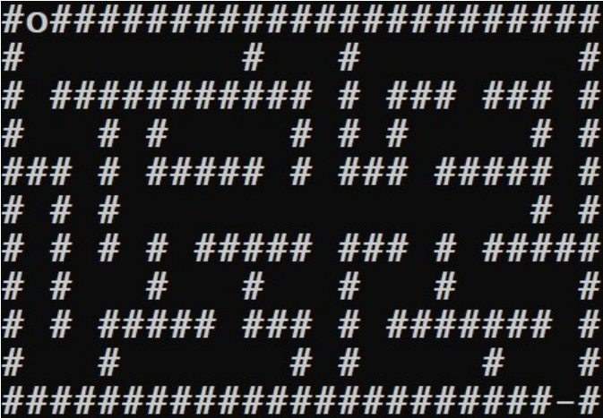

# mazeGenerator

## Introduction

A simple app used to create maze.  

## Project

### PRESENTATION DU PROJET

Le but du projet est la réalisation d’un générateur de labyrinthe, et de son utilisation dans un
jeu. Ce projet est à réaliser en monôme.
Ce projet se fera en quatre étapes, chacune correspondant à un niveau de difficulté et à une
note maximale de projet. Une étape ne doit être abordée que lorsque les étapes précédentes
ont été réalisées. Une étape est validée lorsque toutes les exigences et fonctionnalités
demandées ont été prises en compte, et que le compte-rendu sur cette étape est complété.
Chaque étape devra être validée par l’enseignant de TP au cours d’une séance de TP. La
validation d’une étape n’assure pas une note maximale, même si elle s’en rapproche.
Les critères de notation sont les suivants :

* Respect des consignes des étapes du projet, sur 10 points :
  * Etape 1 (4 points) ;
  * Etape 2 (2points) ;
  * Etape 3 (2 points) ;
  * Etape 4 (2 points).
* Qualité du code fourni, sur 5 points :
  * Lisibilité du code : respect des consignes du cours d’ODL (2 points) ;
  * Optimisation du code, les choix de conception (2 points) ;
  * Tests unitaires (1 point).
* Compte-rendu et validation par l’enseignant de TP, sur 5 points.

Il n’est pas attendu que les tests unitaires couvrent l’intégralité du code, mais les points
essentiels tels que les entrées/sorties (vérification des saisies utilisateurs, gestion des fichiers,
etc.).

#### Livrables

Le rendu du projet sera une archive contenant :

* Le code source de l’application ;
  * Soit les fichiers sources (édités avec emacs ou autre) et un makefile ;
  * Soit un projet réalisé avec CLion ;
* Un exécutable opérationnel (linux ou windows) ;
* Le programme devra être accompagné d’un jeu de tests unitaires réalisés sous MinUnit ;
* Un compte-rendu présentant votre projet, avec les parties suivantes :
  * Un manuel pour le joueur : le fonctionnement du point de vue de l’utilisateur ;
  * Un manuel pour le développeur qui reprendra votre code, montrant :
    * Ce qui a été réalisé, et ce qui reste à faire ;
    * Le fonctionnement des points clés de votre projet, du point de vue du programmeur ;
    * Les limitations et/ou bugs connus.

### TRAVAIL A REALISER

#### Etape 1 (4 points)

Le but est de réaliser un générateur de labyrinthe parfait de taille fixe 11*25. L’algorithme de
génération vous est fourni en annexe. L’affichage sera fait en mode console, tel que présenté
à la Figure 1. Les symboles # représentent les murs du labyrinthe, l’entrée est en haut à gauche
et la sortie en bas à droite. Le personnage à déplacer est représenté par la lettre o. La porte de
sortie est représentée par le symbole –.

#### Etape 2 (6 points)

Au démarrage du programme, un menu permet à l’utilisateur de :

* Créer un labyrinthe
* Charger un labyrinthe
* Jouer
* Quitter

##### 2.1. Créer un labyrinthe

Lors de la création du labyrinthe, l’utilisateur pourra choisir la taille du labyrinthe (hauteur et
largeur impaire) ainsi que son nom. Chaque labyrinthe généré est enregistré dans un fichier au
format .cfg et est automatiquement chargé. L’utilisateur est alors renvoyé au menu.

##### 2.2. Charger un labyrinthe

Lors du chargement, l’utilisateur indique le nom du labyrinthe auquel il souhaite jouer (une
liste des labyrinthes existants pourra lui être proposée). Le programme doit alors lire un fichier
pour recharger un labyrinthe précédemment créé. L’utilisateur est alors renvoyé au menu.

##### 2.3. Jouer

Lance une partie avec un labyrinthe préalablement chargé. L’utilisateur peut alors se déplacer
dans les couloirs du labyrinthe avec l’aide des touches z, q, s et d suivie de la touche entrée.
Lorsque le joueur arrive à la fin du labyrinthe, le programme lui propose à nouveau le menu
de démarrage (créer un labyrinthe, charger un labyrinthe, jouer et quitter).

#### 3. Etape 3 (8 points)

Trois sortes d’objets sont éparpillées de façon aléatoire dans le labyrinthe :

* Une clé, permettant d’ouvrir la porte de sortie du labyrinthe qui se trouve maintenant
verrouillée au début de la partie et qui empêche le joueur de sortir ;
* Des trésors, accordant un certain nombre de points fixes : les bonus d’une valeur de X
points ;
* Des pièges, retirant un certain nombre de points fixes : les malus d’une valeur de Y
points.

A l’initialisation du labyrinthe, la clé et les différentes sortes de bonus/malus sont créées et
réparties au hasard dans le labyrinthe. Le labyrinthe, sa clé et ses bonus/malus ainsi créés seront
sauvegardés.
Un score sera attribué au joueur qui sera fonction de sa rapidité (en nombre de déplacements,
pas en temps) à trouver la clé puis la sortie, et des bonus et/ou malus rencontrés lors de son
parcours. Le score est affiché à chaque déplacement et en fin de partie.
Lorsque l’utilisateur décide de jouer, il joue sa partie comme dans l’étape précédente à la
différence près qu’il doit d’abord ramasser la clé pour pouvoir sortir du labyrinthe. Une fois le
joueur sorti, si son score fait partie des 10 meilleurs déjà enregistrés, le programme l’invite à
saisir son nom et l’enregistre dans un fichier d’extension .score et au nom du labyrinthe.
Une nouvelle entrée sera ajoutée au menu permettant au joueur de visualiser les 10 meilleurs
scores pour le labyrinthe actuellement chargé.

#### 4. Etape 4 (10 points)

On souhaite disposer de deux niveaux de difficultés. Le choix se fera au moment de la création
du labyrinthe. Le mode facile correspond au labyrinthe précédent (parfait avec bonus/malus).
Dans le mode difficile, le labyrinthe dispose maintenant de plusieurs chemins possibles. Pour
cela, il faut supprimer quelques murs supplémentaires de façon aléatoire, une fois le
labyrinthe parfait créée.

De plus, différentes sortes de monstres jalonnent le parcours. Chaque sorte est régie par 2
paramètres :

* Paramètre de mobilité : La mobilité est définie suivant une règle régie par une fonction.
Par exemple, des fantômes pourront traverser les murs, tandis que des ogres resteront
à proximité des trésors qu’ils croiseront.
* Paramètre étendue de mobilité : Le territoire de mobilité est d’autant plus grand que
leur nombre de points de pénalité est grand.

A chaque déplacement du joueur, tous les monstres bougent également suivant leurs propres
paramètres. Vous utiliserez pour cela des pointeurs vers des fonctions.

### Annexes

L’algorithme de génération de labyrinthe à utiliser sera l’algorithme de fusion aléatoire de
chemins tel que décrit dans [ce lien](https://fr.wikipedia.org/wiki/Mod%C3%A9lisation_math%C3%A9matique_d%27un_labyrinthe#Fusion_al.C3.A9atoire_de_chemins)

L’algorithme utilise une propriété des labyrinthes parfaits telle que chaque cellule est reliée
à toutes les autres et, ce, de manière unique. Il fonctionne en fusionnant progressivement
des chemins depuis la simple cellule jusqu'à l'obtention d'un chemin unique, il suit donc une
approche ascendante (bottom-up).

L'algorithme associe une valeur unique à chaque cellule (un numéro, par exemple) et part d'un
labyrinthe où tous les murs sont fermés. À chaque itération, on choisit un mur à ouvrir de
manière aléatoire :

* Lorsqu'un mur est ouvert entre deux cellules adjacentes, les deux cellules sont liées
entre elles et forment un chemin. L'identifiant de la première cellule est recopié dans la
seconde.
* À chaque fois que l'on tente d'ouvrir un mur entre deux cellules, on vérifie que ces deux
cellules ont des identifiants différents :
  * Si les identifiants sont identiques, c'est que les deux cellules sont déjà reliées et
appartiennent donc au même chemin. On ne peut donc pas ouvrir le mur.
  * Si les identifiants sont différents, le mur est ouvert, et l'identifiant de la première
cellule est affecté à toutes les cellules du second chemin.

A project realised during my 1st year in the ENSICAEN.
